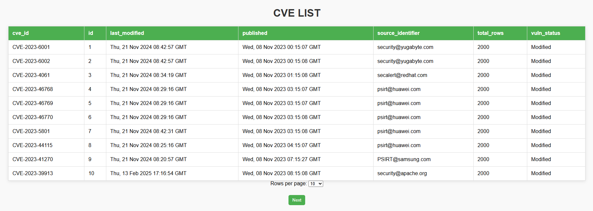
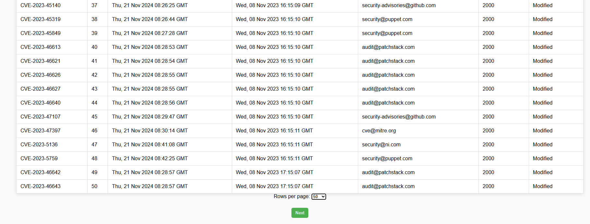
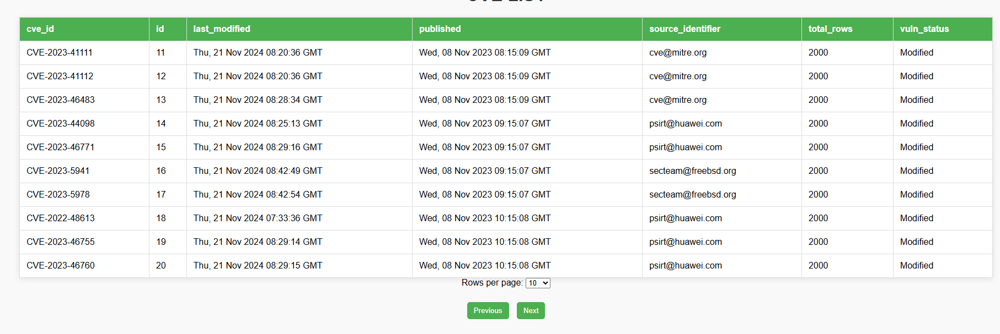
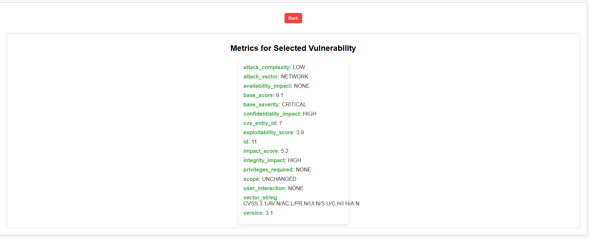

# CVE Project

This project consumes CVE (Common Vulnerabilities and Exposures) information from the NVD (National Vulnerability Database) API, stores the data in a PostgreSQL database, cleanses and transforms the data, and provides an interface to visualize and filter the CVE data. The project also includes a backend API built with Flask and a frontend built using HTML, CSS, and JavaScript.

## Features

- **API Integration**: Fetch CVE data from the NVD API.
- **Data Cleansing**: Handle and clean the data, removing duplicates and inconsistencies.
- **Database Integration**: Store CVE data in a PostgreSQL database (`cve_data`).
- **Custom API Endpoints**: Expose APIs to filter and query CVE data by various parameters:
  - CVE ID
  - CVE year
  - CVE score (CVSS)
  - Last modified in the last N days
- **Frontend Visualization**: Display the CVE data in a table format with pagination and sorting functionality.
- **Data Synchronization**: Periodically update the CVE data in the database either through full or incremental data refreshes.

## Project Structure

    ```bash
    CVE/
    │
    ├── API/
    │   ├── index.html            # Frontend template
    │   ├── app.py                # Flask application file
    │   ├── db.py                 # Database connection & query handling
    │   ├── queries.py            # SQL queries to fetch data from the API
    │   └── routes.py             # API route definitions
    │
    ├── db/
    │   └── database.py           # Database creation & management
    │
    ├── ingestion/
    │   └── fetch_Data.py         # Fetches CVE data from the NVD API
    │
    ├── transformation/
    │   └── transform_Data.py     # Cleanses and transforms CVE data
    │
    ├── .env                      # PostgreSQL DB credentials (DB_NAME, DB_USER, etc.)
    ├── requirements.txt          # Required Python libraries
    └── README.md                 # Project documentation (this file)


## Installation

### Prerequisites

- Python 3.x
- PostgreSQL
- Required libraries (listed in `requirements.txt`)

### Steps

1. **Clone the repository**:

   ```bash
   git clone https://github.com/Sneakyfox1051/CVE.git
   cd CVE
2. **Setup a Virtual Environment**:
   ```bash
   python -m venv venv
   source venv/bin/activate  # On Windows use `venv\Scripts\activate`
3. **Install the dependencies**:
   ```bash
   pip install -r requirements.txt
4. **Setup the database**:
    - Create a PostgreSQL database using the credentials in the `.env` file (`DB_NAME=cve_data`).
    - Update the `.env` file with your PostgreSQL connection details:
      - `DB_USER`: Your PostgreSQL username
      - `DB_PASSWORD`: Your PostgreSQL password
      - `DB_HOST`: The host where your PostgreSQL server is running (typically `localhost`)
      - `DB_PORT`: The port where your PostgreSQL server is listening (default is `5432`)
      - `DB_NAME`: The name of the database (`cve_data` by default)
5. **Run the Flask application**:

    ```bash
    python API/app.py
  The application will run on http://localhost:5000.

       

## Output

### 1. Displaying 10 Records Per Page
The UI initially loads and displays **10 CVE records** per page.



---

### 2. Displaying 50 Records Per Page
Users can change the **"Results Per Page"** option to **50** to view more data.



---

### 3. Navigating to the Next Page
Pagination allows users to navigate through the dataset and load the **next 10 records**.



---

### 4. Viewing Details of a Specific CVE ID
Clicking on a CVE ID redirects the user to a detailed view of that specific record.



---

# Test Cases for CVE Project

This document outlines the test cases for the CVE Project. The test cases are written using Python's `unittest` framework and ensure that different modules of the project function correctly.

## Running the Tests

To execute all test cases, navigate to the project root directory and run:

```sh
python -m unittest discover tests
```

Alternatively, you can run individual test files:

```sh
python -m unittest tests/test_routes.py
python -m unittest tests/test_db.py
python -m unittest tests/test_queries.py
python -m unittest tests/test_fetch_data.py
python -m unittest tests/test_transform_data.py
```

## Test Case Breakdown

### 1. `test_routes.py`
- Ensures that Flask API routes return expected responses.
- Tests different endpoints for filtering CVE data.
- Verifies status codes and JSON structure.

### 2. `test_db.py`
- Tests database connectivity and query execution.
- Ensures data is correctly inserted, updated, and retrieved.

### 3. `test_queries.py`
- Verifies that SQL queries return expected results.
- Tests edge cases such as empty results or invalid parameters.

### 4. `test_fetch_data.py`
- Ensures data is fetched correctly from the NVD API.
- Mocks API responses to test different scenarios.

### 5. `test_transform_data.py`
- Validates that CVE data transformation handles inconsistencies properly.
- Checks whether CVSS scores, weaknesses, and configurations are correctly parsed.

## Expected Output

If all tests pass, you should see output similar to:

```sh
.....
----------------------------------------------------------------------
Ran 5 tests in 0.002s

OK
```

If any test fails, an error message will indicate which test failed and why. Debug the issue based on the traceback provided.

## Notes
- Ensure the database is running before executing tests that interact with it.
- Use a virtual environment to manage dependencies (`requirements.txt`).
- Mock external API calls in tests to avoid unnecessary network requests.

---

This ensures that the project maintains high reliability and correctness. Happy testing!
